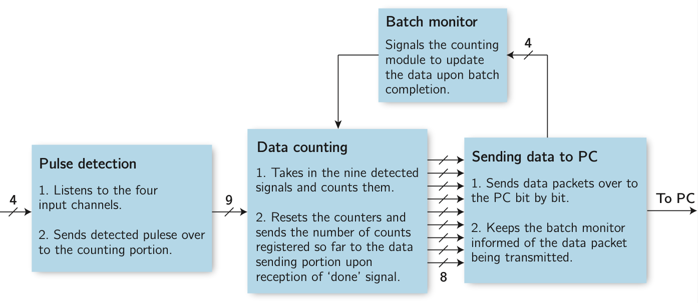
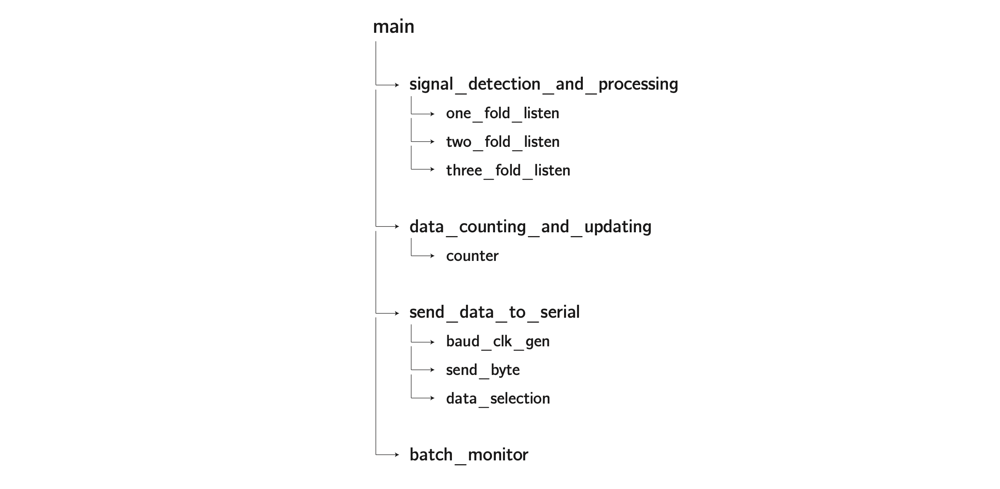
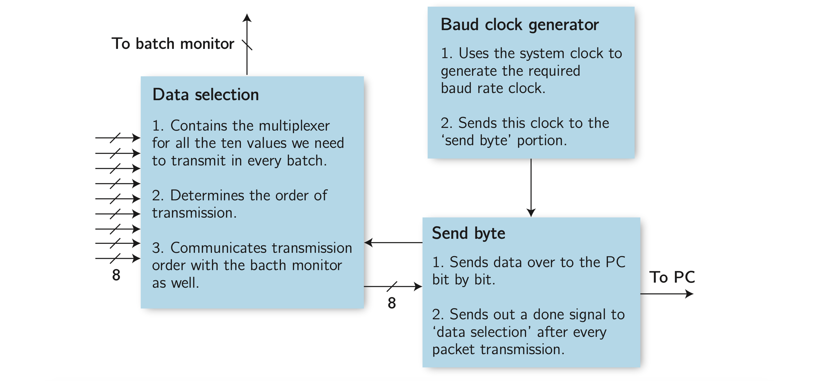
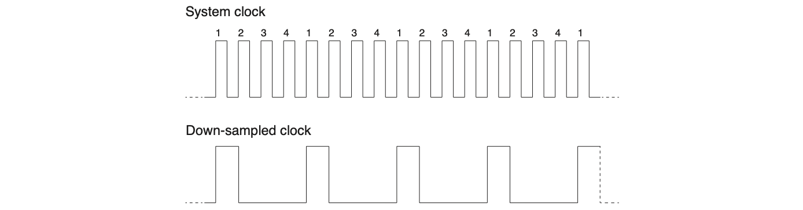

# Introduction
These files are to be used with Xilinx Vivado. Import these files as part of your project. Take the codes through the necessary compilation steps, and you will end up with a .bit file that you can use to program the FPGA.

**Source codes:** These files constitute the modules that, when combined, carry out the desired functionality.

**Test benches:** These files are to simulate the circuitry defined by the source codes. User-defined dummy signals can be input to the simulated circuitry, and the output can be observed to confirm the expected behavior.

# High-level description
Before we jump into the coding phase, we should have a good idea of the functionality we need to implement. We need to develop a CCU that counts the incoming pulses from four channels (A, B, B′ and A′), their coincidences, and sends the data over to the PC. The functionality of the CCU can be broken down into four major portions. The schematic workflow shown in the figure below shows how these portions are connected via wires between them. The arrows in the figure show the direction of data flow, while the numbers over arrows with crosses represent the number of bits each bus (a channel comprising more than 1 bit) carries. An arrow without a cross represents a single bit.

### Pulse detection
In this portion, the circuit needs to generate the required single-pulse and coincidence pulse channels, detect the incoming pulses on these channels, and communicate each detection to the counting portion.

### Data counting
This portion of our circuitry receives detection signals from the pulse detection and counts them until it gets the “reset” signal. Once it does get the “reset” signal, it stores the count value in the data-storage circuit elements called registers and starts counting the new pulses again from zero.

### Send data to PC
This final portion sends the information about the pulses counted to the PC using a communication protocol known as UART, which stands for Universal Asynchronous Receiver and Transmitter.

### Batch monitor
Notice that the data counting and sending portions should be synchronized. The values available to the sending portion should change only when it has successfully transmitted one batch of data. The small portion of our circuitry, named the batch monitor, ensures this synchronization by sending pulses that trigger the data update.

# Low-level description

In Verilog, we divide the tasks we need to perform into portions of code called modules, and each module may be split further into hierarchically lower-level modules. While the four portions of the flowchart shown above will translate to four core modules of our Verilog code, the complete picture below illustrates how the modules will build the whole circuitry.

Let's have a deep dive into the submodular description of our circuitry.

## Core 1

### one_fold_listen
This module gets triggered at every rising edge of the clock signal originating from the development board’s oscillating crystal. It _listens_ to the photo-detection pulses from one of the input channels, i.e., at every rising edge of the clock signal, it checks for a high voltage. Upon detection of a high voltage, it stores the value “1” in a register for the time period equivalent to one cycle of the FPGA clock. Note that the FPGA clock’s time period might be much shorter than the input signal's. In that case, there is a high chance of an event whereby two rising edges of the clock signal fit in the duration of a single photo-detection pulse; this would result in a double count, and we want to avoid it. To cater to this, whenever we detect a pulse, we assign another storage element a finite value. Every cycle of the FPGA will then reduce the value of dead time by 1 until only it reaches 0, and until it does, the clock signal will abstain from listening to the input signal.

### two_fold_listen and three_fold_listen
These two modules for coincidence detection work in a fashion similar to the **one_fold_listen** module. The only difference is that these modules should register a signal only when they simultaneously receive pulses on all the inputs. This simultaneous detection can be accomplished by applying AND gates on all the required inputs before exposing the signal to the clock.

### signal_detection_and_processing
Now that we have all the required components for single and coincidence pulse detection, we need to populate signal detection and processing—one of our core modules—with instances of these hierarchically lower modules and declare the required interfaces. As per our project requirements, we have included nine pulses in total. Four of these pulses are single detector pulses, four are two-fold coincidence detection pulses, and one is a three-fold coincidence detection pulse.

## Core 2

The pulses produced by the **signal_detection_and_processing** module are fed into **data_counting_and_updating**, another core module. This module counts these pulses until the data is ready to be transmitted. There will be separate modules containing registers dedicated to each input pulse separately.

Like our detection and processing modules, each sub-module in this core module also gets triggered at the rising edge of an FPGA’s clock signal. They first check for a reset signal, and if it is set on a logical high, it updates the data registers with the number of counts it has registered since the last reset signal and sets the current count to zero. This way, the counts are updated for the data-sending part of the circuit.

## Core 3
So far, we have detected, processed, and stored the data on the FPGA. Now, we need to send this data to a PC where it can be displayed, stored, or processed as required. In digital communication channels, data is transferred in bits. The two devices about to communicate should agree upon a mutually agreed rule of communication (a communication protocol). We chose the universal asynchronous receiver transmitter (UART) protocol to send data over to the PC. This section will discuss the nitty gritty for successful communication using UART. Our implementation will be a one-way communication channel from the FPGA to the PC. We will divide our third core module **send_data_to_serial** into three portions and, hence, three hierarchically lower modules, as illustrated in the image below.

### baud_gen
The UART data communication protocol is asynchronous because there is no external clock signal to ensure the two communicating devices work in temporal synchronization with each other. Instead, for successful communication, the two devices should have a prior agreement on the rate at which they want to communicate. This communication rate for the UART channel is known as the _baud rate_. The two devices need to ensure communication at this rate using their independent clocks. For the FPGA side’s _baud rate clock_, we make another module. This module will take in the FPGA clock signal, wait for a specific number of clock cycles, and output a logical high when this number is reached. We will call this output the baud rate clock.

In single photon laboratories, high-speed communication between the CCU and the PC is required, so we set the baud rate to the highest value available. In our current implementation, the target baud rate is 4 MHz. Considering our input FPGA clock of 100 MHz, we assign the value 25 to a variable. This module counts the rising edges of the FPGA clock signal until it reaches 25 and outputs a pulse once it does. This way, we have generated a baud rate clock for the FPGA. This process is an example of down-sampling, and the figure below provides its visual representation.

### send_byte
Unlike the rest of the modules we have come across so far, this module has two triggers instead of one. It gets triggered whenever there is a change in the data bits or whenever the baud rate clock has a rising edge. Upon a data-update trigger, it takes the newly available data bits and creates a data packet by enclosing them in the start and stop bits. Whereas for each rising edge trigger, this module sends a single bit from the data packet to the transmission channel. This way, the data packet is sent to the PC bit by bit at the specified baud rate. Ten rising edges of the baud clock will result in the transmission of the whole packet.

Other than sending the data over to the communication channel, this module also outputs a pulse to signal for the completion of a packet transfer – we will call this completion pulse the _done signal_. This done signal will be used in the **data_selection** module to stimulate a change in the data bits. New data bits will trigger the **send_byte** module again, and it will make a new data packet to transfer.

### data_selection
This module changes the data bits being fed to the **send_byte** module. We have nine data values that we need to send over to the PC. Additionally, we also send a header to mark the start of a batch of data packets. These ten values are stored in 8-bit registers and will be sent to the PC one by one. Transmission starts with the header, and the rest of the packets are sent in a specific order, as illustrated in the figure below. To choose which packet to send, we add all nine data registers on the inputs of a LUT. Altering the selection input will change the data bits being output by the LUT. A LUT can easily be implemented using case statements Verilog.

This module gets triggered at the rising edge of the done tick being received from the **send_byte** module. Upon each trigger, the selection input of the LUT gets updated. The value of selection input varies from 0 to 9 in a loop, covering all the ten values in a batch. The selection input is also shared with the batch monitor module that maintains the workflow of our circuitry.

## main
The main module sits at the top of the module hierarchy. By this point, we have developed all the required low-level modules; now, we just need to join them together in a single module to complete our CCU’s implementation. Said differently, we need to define the interconnects between the three core modules and the batch monitor. There is no need to instantiate the hierarchically lower modules separately, as they are already part of the core modules.

# Compiling the project
I compile the project, import all of the Verilog files in Xilinx Vivado, make the **main** module the hierarchically highest, and follow the compilation steps in Vivado. To see how to execute these steps, you may watch this [tutorial](https://www.youtube.com/watch?v=v4i8pp1eahQ) by [Aleksandar Haber](https://github.com/AleksandarHaber).

To learn how UART communication works, you may refer to this small article of mine: [What is UART serial communication protocol?](https://www.educative.io/answers/what-is-uart-serial-communication-protocol)

In case of any confusion, feel free to reach out at bilal.samurai@gmail.com
